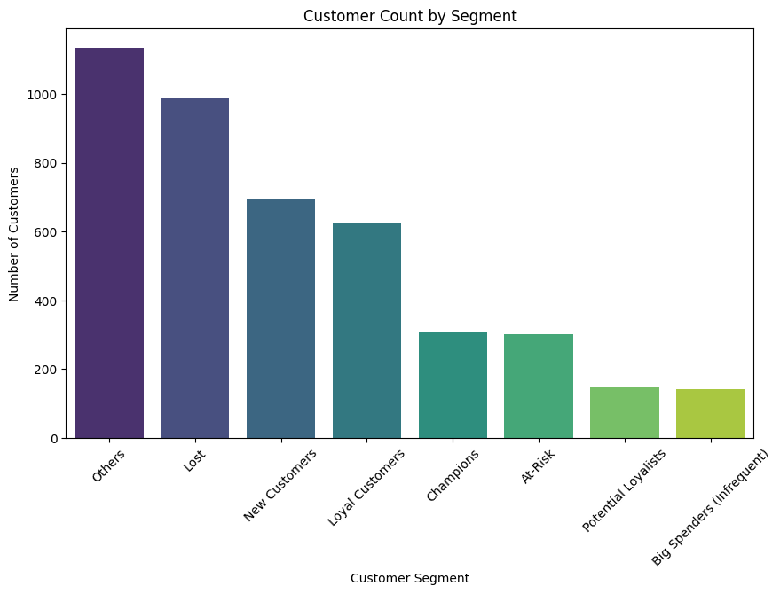

# Customer Segmentation using RFM Analysis

### Project Overview
This project uses the Online Retail Dataset to perform customer segmentation based on the RFM (Recency, Frequency, Monetary) model. The goal is to analyze customer purchasing behavior, group similar customers into segments, and identify opportunities for targeted marketing.

### Key Findings
* **Customer Segmentation**: The customer base was segmented into distinct groups such as Champions, Loyal Customers, and At-Risk customers.
* **Customer Distribution**: The majority of customers fell into the general "Others" or "Lost" categories, highlighting the need to focus marketing efforts on the smaller, more valuable segments.
* **Strategic Insights**: The analysis identifies key customer groups for specific marketing actions, such as rewarding Champions and re-engaging At-Risk customers.

### Visualizations
The final analysis is summarized by a bar chart showing the distribution of customers across the defined segments.

### Tools & Libraries
* Python
* Pandas
* Seaborn
* Matplotlib

### Data Source
The dataset used for this project is the [Online Retail Dataset](https://archive.ics.uci.edu/ml/datasets/Online+Retail) from the UCI Machine Learning Repository.
